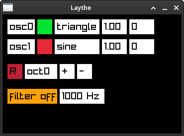

# Laythe Synthesizer

Laythe is a dual oscillator standalone polyphonic synthesizer, up to 8 voices.



## Features

Layhte uses a simple UI to control paramaters such as enabling/disabling oscillators, selecting wavetables, changing oscillator volume, and more. Layhte can be controlled with a USB MIDI controller or your computer's keyboard (by passing the `--keyboard` option).

### Recording

Laythe can toggle recording the current session by pressing R or pressing the red recording button. Files are saved in WAV format to `recordings/` in this directory.

## Build and Run

Clone this repository and build [raylib](https://github.com/raysan5/raylib) with:

```bash
git clone --recurse-submodules https://github.com/lukesnc/laythe-synth.git
cd laythe-synth/thirdparty/raylib/src/
make
cd ../../../
```

Now build and run Laythe with:

```bash
make && ./laythe
```
