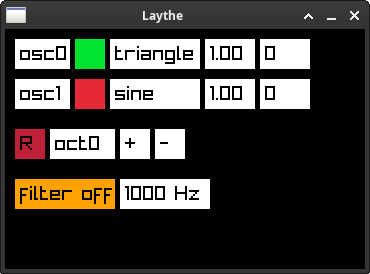

# Laythe Synthesizer

Laythe is a dual oscillator standalone polyphonic synthesizer, up to 8 voices. Works on Windows, macOS, and Linux.



## Features

Layhte uses a simple UI (powered by [raylib](https://github.com/raysan5/raylib)) to control paramaters such as enabling/disabling oscillators, selecting wavetables, changing oscillator volume, and more. Layhte can be controlled with a USB MIDI controller or your computer's keyboard.

### Recording

Laythe can toggle recording the current session by pressing R or pressing the red recording button. Files are saved in WAV format to the `recordings/` folder in this directory.

## Building

Clone this repository and build Laythe:

```bash
git clone --recurse-submodules https://github.com/lukesnc/laythe-synth.git
make
```

## Usage

```
./laythe -h
usage: ./laythe [--dev /dev/<midi_controller>] [--keyboard]
```

The default MIDI device that is checked for is `/dev/snd/seq`. This can be overridden by passing a device with `--dev`.

Laythe can also be controlled with the keyboard by passing the `--keyboard` option.

Black keys: W-P

White keys: A-;

## TODO

- Add envelope generators so notes aren't just 100% on or off.
- Fix oscillator fine tuning behavior.
- Change octave shift to be oscillator specific.

## References

- <https://ccrma.stanford.edu/~craig/articles/linuxmidi/>
- <https://en.wikipedia.org/wiki/Triangle_wave>
